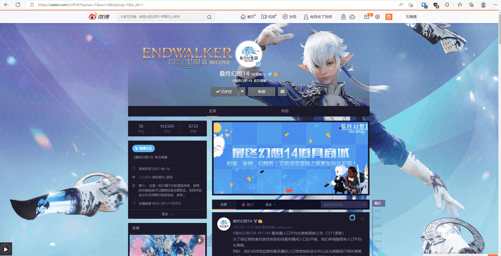
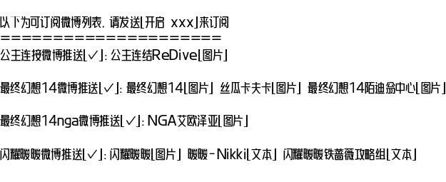
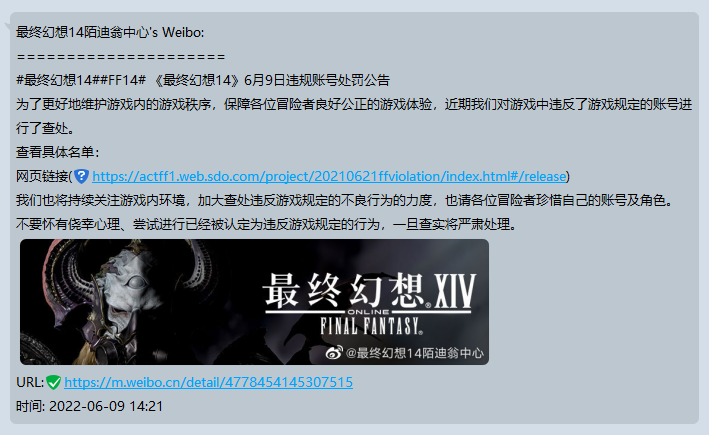
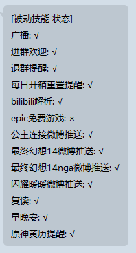

# zhenxun_plugin_weibo
移植自[KokkoroBot-Multi-Platform](https://github.com/zzbslayer/KokkoroBot-Multi-Platform)
## 使用
在插件目录下的weibo_config.json添加用户配置

config.yaml改变forward_mode配置项来设置是否以转发模式推送微博
> 首次使用需要重启一次才可以在group_manager.json中增加配置项
```yaml
weibo-ff14:                         # 对应到config.yaml中_task下的DEFAULT_WEIBO_FF14
  desciption: 最终幻想14微博推送    # 群内开关，在群被动状态中可以查看，使用[开启/关闭 最终幻想14微博推送]即刻控制
  enable_on_default: false          # 是否默认启用，对应到config.yaml中_task下的DEFAULT_WEIBO_FF14: True
  users:                            # 该推送组所包含的所有微博用户
  - user_id: '1797798792'           # 用户id, 博主主页打开控制台执行$CONFIG.oid获取
    filter_retweet: false           # 是否仅推送原创，若是，则设定为false
    filter_words:                   # 屏蔽词，包含屏蔽词的微博将被过滤
    - 微博抽奖平台
  - user_id: '1794603954'           # 该组其他用户...
    filter_retweet: false
    filter_words: []
  - user_id: '7316752765'
    filter_retweet: false
    filter_words: []
```

## 如何获取user_id
控制台输入`$CONFIG.oid`


## 指令

```
可订阅微博列表（需要at）
```

其他则是类似寻常被动任务一样配置

## 示例



