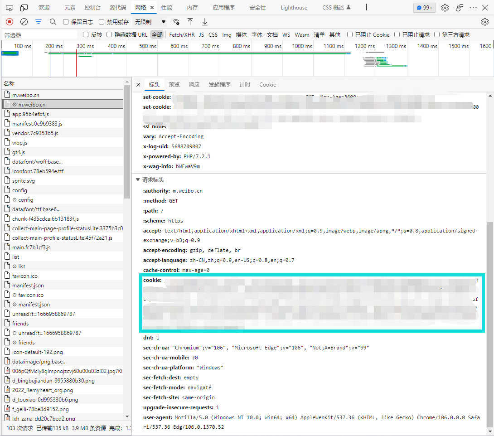

# zhenxun_plugin_weibo
<div>
   <a href="https://github.com/HibiKier/zhenxun_bot">
    
</div>
   
移植自[KokkoroBot-Multi-Platform](https://github.com/zzbslayer/KokkoroBot-Multi-Platform)
## 使用
**在插件目录下的`weibo_config.yaml`中配置微博订阅项**

**于真寻的`config.yaml`中改变插件的`FORWARD_MODE`配置项来设置是否以转发模式推送微博**

**于真寻的`config.yaml`中改变插件的`DEFAULT_FORMAT`配置项来设置微博默认推送格式，可选格式为文本、图片**
> format覆盖规则：组内用户配置项 > 推送组配置项 > 配置文件

**于真寻的`config.yaml`中添加插件的`COOKIE`配置项，设置[COOKIE](#如何获取cookie)后可获取更多微博**

以下为微博订阅项说明

**订阅项中的所有`user_id`都可替换为`keyword`，替换后表示推送包含`keyword`关键词的所有微博**

```yaml
weibo-ff14:                         # 对应到config.yaml中_task下的DEFAULT_WEIBO_FF14
  desciption: 最终幻想14微博推送    # 群内开关，在群被动状态中可以查看，使用[开启/关闭 最终幻想14微博推送]即可控制
  enable_on_default: false          # 是否默认启用，对应到config.yaml中_task下的DEFAULT_WEIBO_FF14: False
  format: 1                         # （可选配置项）（推送组配置项）若缺少该配置项，则以配置文件的default_format填充
  users:                            # 该推送组所包含的所有微博用户
  - user_id: '1797798792'           # 用户id, 博主主页打开控制台执行$CONFIG.oid获取
    format: 0                       # （可选配置项）（组内用户配置项）若缺少该配置项，则以该推送组的format填充
    filter_retweet: false           # 是否仅推送原创（过滤转发），若是，则设定为true
    filter_words:                   # 屏蔽词，包含屏蔽词的微博将被过滤
    - 微博抽奖平台
  - user_id: '1794603954'           # 该组其他用户...
    filter_retweet: false
    filter_words: []
  - keyword: '小红猫'                # 关键词，表示推送所有包含该关键词的微博
    filter_retweet: false
    filter_words: []
```

## 如何获取user_id
<!-- 控制台输入`$CONFIG.oid`
 -->
1. 前往[https://m.weibo.cn/](https://m.weibo.cn/)
2. 搜索并打开微博用户主页，地址栏URL显示为`https://m.weibo.com/u/xxxxx`，xxxxx即为user_id

## 如何获取cookie
1. 前往[https://passport.weibo.cn/signin/login](https://passport.weibo.cn/signin/login)登录
2. F12打开开发者工具
3. 访问[https://m.weibo.cn/](https://m.weibo.cn/)（CTRL+R刷新下）
4. 复制如下选框

## 指令

```
可订阅微博列表（需要at）
```

其他则是类似寻常被动任务一样配置

## 示例


